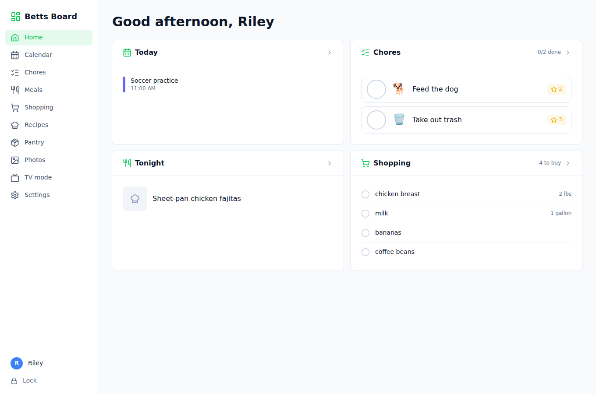
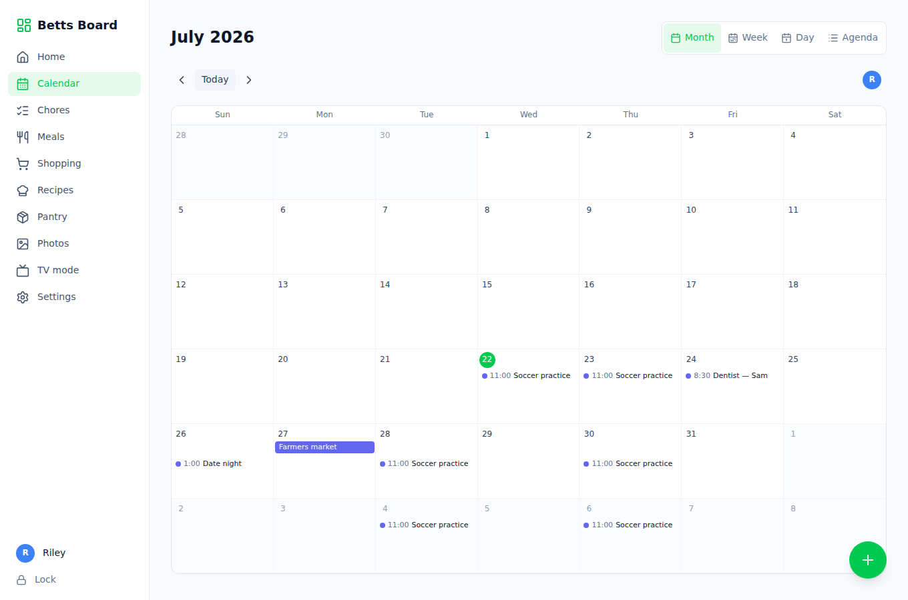
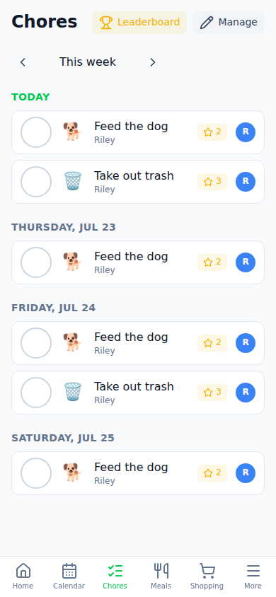

# Betts Board

**A self-hosted family organizer for the kitchen tablet, the TV, and everyone's
phones.** One Docker container, one data volume, no subscriptions, no accounts
with big tech — your family's calendar, chores, recipes, and photos stay on
your own server.



| Calendar | Chores on a phone |
| --- | --- |
|  |  |

## Features

- 📅 **Family calendar** — month/week/day/agenda views, color-coded per person,
  recurring events (daily/weekly/monthly/quarterly/yearly/custom) with proper
  "edit this / this and future / all" handling
- ✅ **Chores** — assign to family members, recurring schedules, points,
  streaks, and a leaderboard the kids will actually check
- ⭐ **Rewards store** — kids spend earned chore stars on parent-defined
  rewards; balances and history are tracked automatically
- 🍳 **Recipes** — paste a link and the recipe is parsed and saved locally
  (ingredients, steps, photo); rate it, note tweaks ("double the sauce next
  time"), and edit freely
- 🗓️ **Meal planning** — plan the week's meals from your recipe box, sorted by
  what the family rated best; assign who's cooking and a prep block sized to
  the recipe (+15 min padding) lands on their calendar, ending at mealtime
- 🛒 **Shopping lists** — generated from the meal plan with smart quantity
  merging, aisle grouping, and fast in-store check-off; or cherry-pick
  ingredients from any planned meal straight onto a list
- 🥫 **Pantry** — track what you have (scan barcodes with your phone camera);
  shopping generation skips what's already in the pantry
- 🖼️ **Photo slideshow** — upload family photos; idle wall displays become a
  photo frame with clock, weather, and today's agenda
- 📡 **Calendar feeds** — subscribe to school/sports iCal feeds; subscribe your
  phone's calendar app to the family board
- 🌤️ **Weather** — Open-Meteo, no API key, °F or °C
- 🔔 **Push notifications** — event reminders and chore nudges (requires HTTPS)
- 📺 **TV mode** — big-type dashboard and slideshow for any TV browser
- 🎨 **Appearance** — household-wide font choice and accent colors, set
  separately for light and dark mode
- 🔌 **Public API** — token-authenticated REST API for Home Assistant, scripts,
  and anything else (see the [API reference](#api-reference) below); keys
  managed in Settings

## Quick start

Requires Docker + Docker Compose on any Linux box, NAS, or Raspberry Pi 4/5.

```bash
git clone https://github.com/Riley-D-Betts/betts-board.git
cd betts-board
docker compose up -d --build
```

Open `http://your-server:3000` and follow the setup wizard: household name,
one shared password, your town (for weather), and a profile for each family
member. That's the whole install — the database, uploaded photos, and recipe
images all live in the `betts-data` volume.

## HTTPS

Push notifications, installing to a phone home screen (PWA), and the camera
barcode scanner require a secure context (HTTPS). Everything else works over
plain HTTP on your LAN. Easy paths:

1. **Caddy sidecar** — uncomment the `caddy` service in `docker-compose.yml`
   and set your domain; certificates are automatic.
2. **Existing reverse proxy** — point Traefik / Nginx Proxy Manager / Caddy at
   port 3000.
3. **No domain?** [Tailscale](https://tailscale.com) gives every device a
   secure HTTPS-capable address with zero certificate fuss.

## Everyday use

- **Phones** — open the site → "Add to Home Screen"; it installs as an app.
- **Kitchen tablet** — sign in once (sessions last 90 days), flip on
  *Settings → This device → Use as wall display*, and it becomes a photo frame
  whenever it sits idle. Tap or press any key to get back to the board.
- **TV** — open `/tv` in the TV browser for the big-type dashboard, or
  `/tv/slideshow` to go straight to photos.
- **School calendar** — *Settings → Calendar feeds → Add* with the iCal URL.
- **Your phone's calendar app** — subscribe to the private URL under
  *Settings → Calendar feeds → Subscribe on your phone*.

## Backup & restore

Everything lives in one volume: the SQLite database plus the `uploads/` folder.

```bash
# Backup
docker compose stop betts-board
docker run --rm -v betts-board_betts-data:/data -v "$PWD":/backup alpine \
  tar czf /backup/betts-backup.tar.gz -C /data .
docker compose start betts-board

# Restore into a fresh install
docker run --rm -v betts-board_betts-data:/data -v "$PWD":/backup alpine \
  tar xzf /backup/betts-backup.tar.gz -C /data
docker compose up -d
```

Forgot the household password? Start one boot with `BETTS_RESET_PASSWORD=1`
and the unlock screen lets you set a new one.

## Configuration

| Env var | Default | Purpose |
| --- | --- | --- |
| `TZ` | `UTC` | Container timezone — set it to your home timezone |
| `BETTS_DATA_DIR` | `/data` | Where the database and uploads live |
| `NUXT_SESSION_PASSWORD` | auto-generated | Cookie-sealing secret; created and persisted in the data volume automatically |
| `BETTS_RESET_PASSWORD` | unset | Set to `1` for one boot to reset the household password |
| `PORT` | `3000` | HTTP port inside the container |

Everything else — weather location, temperature unit, week start, meal times,
default cook, appearance, slideshow behavior, feeds, notifications, API keys —
is configured in the app under **Settings**.

## Tech stack

Nuxt 4 full-stack (one Nitro server, no separate backend) · SQLite via Drizzle
ORM with migrations applied automatically on boot · Nuxt UI v4 + Tailwind ·
`rrule` for RFC 5545 recurrence · sharp for image processing · Web Push with
auto-provisioned VAPID keys · installable PWA.

## Development

```bash
npm install
npm run dev          # http://localhost:3000
npm test             # unit tests (recurrence/DST, parsers, aggregation, ICS…)
npm run lint
npm run typecheck
npm run db:generate  # regenerate migrations after editing server/db/schema
```

Architecture notes live in [CLAUDE.md](./CLAUDE.md). The short version: every
feature is a **vertical slice** — its components, API routes, service logic,
DB schema, and validation each live in a per-feature folder — so adding a
feature means adding folders, not untangling existing code. All recurrence
math flows through one DST-safe engine
(`server/services/calendar/recurrence.ts`), and imported ICS feeds share the
same expansion pipeline as local events.

## Contributing

Issues and PRs welcome. Before opening a PR: `npm test && npm run lint`, and
keep changes inside their feature slice (see [CLAUDE.md](./CLAUDE.md)).

## License

[AGPL-3.0](./LICENSE) — free to use, modify, and self-host; if you run a
modified version as a service for others, you share your changes too.

## API reference

Every screen in the app talks to these same endpoints — anything the board can
do, an API client can do too.

### Authentication

Create a key in **Settings → API access** (admin only). The token (`bb_…`) is
shown exactly once; only its hash is stored. Send it on every request:

```
Authorization: Bearer bb_your_token_here
```

- A key **bound to a profile** acts as that family member: its requests can use
  every route that member could, and actions (completing chores, adding notes)
  are attributed to them. A key bound to an **admin** profile can also manage
  settings-level routes (feeds, profiles, API keys).
- An **unbound** key is read-mostly: it can only call routes that don't need an
  acting profile (marked *unlocked* below). Routes marked *profile* return
  `403 No acting profile`.
- Revoked keys, and keys bound to an archived profile, get `401 Invalid API key`.

### Base URL

All paths below are relative to your board's origin, e.g.
`https://board.example.com`. JSON in, JSON out (`Content-Type: application/json`
on requests with a body).

### Errors

Standard HTTP status codes with a human-readable `statusMessage`:
`400` invalid input (zod validation), `401` missing/invalid auth, `403` not
allowed for this key/role, `404` not found, `409` setup required.

### Conventions

- IDs are UUID strings.
- Instants (timed events) are **epoch milliseconds**; calendar dates (all-day
  events, chore due dates, meal-plan dates) are **`YYYY-MM-DD` strings** in the
  household's local calendar — never timezone-converted.
- Date-range windows are half-open: `start` inclusive, `end` exclusive.
- Recurrence rules are bare RRULE bodies (`FREQ=WEEKLY;BYDAY=MO` — no `DTSTART`).

### Calendar & events

| Method | Path | Auth | Body / query |
|---|---|---|---|
| GET | `/api/calendar` | unlocked | query `start`, `end` (epoch ms, end exclusive), optional `profileIds` (comma-separated) — returns expanded occurrences (events + feed events) |
| POST | `/api/events` | profile | `title`, `isAllDay`, timed: `startAt`/`endAt` (ms) or all-day: `startDate`/`endDate`, `timezone`, optional `description`, `location`, `rrule`, `reminderMinutes[]`, `color`, `attendeeProfileIds[]` |
| GET | `/api/events/:id` | profile | series detail (attendees, exception count, source feed) |
| PATCH | `/api/events/:id` | profile | `scope` (`all`\|`this`\|`future`), `occurrenceStart` (ms, required for `this`/`future`), `changes` (partial event fields). Feed events are read-only (403) |
| DELETE | `/api/events/:id` | profile | `scope`, `occurrenceStart` — same scoping as PATCH |

### Chores

| Method | Path | Auth | Body / query |
|---|---|---|---|
| GET | `/api/chores` | unlocked | chore definitions |
| POST | `/api/chores` | profile (adult) | `title`, `startDate` (YYYY-MM-DD), `assigneeProfileIds[]`, optional `rrule`, `dueTime` (HH:MM), `points`, `emoji`, `description`, `recurrenceEnd` |
| PATCH | `/api/chores/:id` | profile (adult) | partial chore fields + `archived` |
| DELETE | `/api/chores/:id` | profile (adult) | archives the chore |
| GET | `/api/chores/board` | unlocked | query `start`, `end` (YYYY-MM-DD, end exclusive) — expanded per-assignee instances |
| POST | `/api/chores/:id/complete` | profile | `dueDate` (YYYY-MM-DD), `profileId` (the assignee). Kids may only complete their own |
| DELETE | `/api/chores/:id/complete` | profile | same body — undoes a completion |
| GET | `/api/chores/leaderboard` | unlocked | query `period` = `week`\|`month`\|`all` |

### Recipes

| Method | Path | Auth | Body / query |
|---|---|---|---|
| GET | `/api/recipes` | unlocked | query `q`, `tag`, `sort` = `recent`\|`rating`\|`title` |
| POST | `/api/recipes` | profile | `title`, optional `description`, `sourceUrl`, `prepMinutes`, `cookMinutes`, `totalMinutes`, `servings`, `steps[]`, `tags[]`, `ingredients[]` (`{ raw, quantity?, unit?, name?, note? }`) |
| POST | `/api/recipes/import` | profile | `url` — scrapes the recipe page |
| GET | `/api/recipes/:id` | unlocked | full recipe with ingredients, ratings, notes |
| PATCH | `/api/recipes/:id` | profile | partial recipe fields |
| DELETE | `/api/recipes/:id` | profile | |
| PUT | `/api/recipes/:id/rating` | profile | `rating` (1–5) — the acting profile's rating |
| POST | `/api/recipes/:id/notes` | profile | `body` |
| DELETE | `/api/recipes/:id/notes/:noteId` | profile | own notes; admins any |

### Meal plan

| Method | Path | Auth | Body / query |
|---|---|---|---|
| GET | `/api/meal-plan` | unlocked | query `start`, `end` (YYYY-MM-DD, end exclusive) |
| POST | `/api/meal-plan/entries` | profile | `date`, `slot` (`breakfast`\|`lunch`\|`dinner`\|`snack`), exactly one of `recipeId` / `freeText`, optional `servingsOverride` |
| PATCH | `/api/meal-plan/entries/:id` | profile | partial entry fields |
| DELETE | `/api/meal-plan/entries/:id` | profile | |
| GET | `/api/meal-plan/entries/:id/ingredients` | unlocked | scaled ingredient list for a recipe-backed entry |

### Shopping lists

| Method | Path | Auth | Body / query |
|---|---|---|---|
| GET | `/api/shopping-lists` | unlocked | lists with unchecked counts |
| POST | `/api/shopping-lists` | profile | `name`, optional `isDefault` |
| GET | `/api/shopping-lists/:id` | unlocked | list with items |
| PATCH | `/api/shopping-lists/:id` | profile | `name`, `isDefault` |
| DELETE | `/api/shopping-lists/:id` | profile | |
| POST | `/api/shopping-lists/:id/items` | profile | `name` (quick-add parses "2 lbs chicken"), optional `displayQuantity`, `quantity`, `unit`, `category` |
| PATCH | `/api/shopping-lists/:id/items/:itemId` | profile | partial item fields + `checked`, `sortOrder` |
| DELETE | `/api/shopping-lists/:id/items/:itemId` | profile | |
| POST | `/api/shopping-lists/:id/clear-checked` | profile | `toPantry` (bool) — optionally move checked items into the pantry |
| POST | `/api/shopping-lists/:id/items/from-recipe` | profile | `recipeId`, `ingredientIds[]`, optional `scale`. Use `default` as `:id` for the default list |
| POST | `/api/shopping-lists/generate` | profile | `start`, `end` (YYYY-MM-DD), optional `listId` (default list when omitted), `ignorePantry` — builds a list from the meal plan |

### Pantry & barcodes

| Method | Path | Auth | Body / query |
|---|---|---|---|
| GET | `/api/pantry` | unlocked | query `q` (name filter) |
| POST | `/api/pantry` | profile | `name`, optional `quantity`, `unit`, `category`, `barcode` — upserts by normalized name |
| PATCH | `/api/pantry/:id` | profile | partial item fields |
| DELETE | `/api/pantry/:id` | profile | |
| GET | `/api/barcode/:code` | unlocked | product lookup (6–14 digits; Open Food Facts + local cache) |
| POST | `/api/barcode` | profile | `barcode`, `productName`, optional `brand` — remember a manual name for an unknown code |

### Photos & slideshow

| Method | Path | Auth | Body / query |
|---|---|---|---|
| GET | `/api/photos` | unlocked | query `cursor` (last id of previous page), `limit` (≤100) |
| POST | `/api/photos` | profile | `multipart/form-data` — one or more image files, ≤25 MB each |
| PATCH | `/api/photos/:id` | profile | `inSlideshow` (bool) |
| DELETE | `/api/photos/:id` | profile | |
| GET | `/api/slideshow` | unlocked | shuffled slideshow manifest + display settings |

Image URLs in responses are session-gated `/uploads/…` paths — fetch them with
the same `Authorization` header.

### Weather

| Method | Path | Auth | Body / query |
|---|---|---|---|
| GET | `/api/weather` | unlocked | cached forecast for the household location; `404` until a location is configured in Settings |

### Calendar feeds (ICS subscriptions)

| Method | Path | Auth | Body / query |
|---|---|---|---|
| GET | `/api/feeds` | unlocked | |
| POST | `/api/feeds` | admin | `name`, `url`, optional `color`, `fetchIntervalMinutes` (15–1440) — fetches immediately |
| PATCH | `/api/feeds/:id` | admin | partial fields + `enabled` |
| DELETE | `/api/feeds/:id` | admin | also removes the feed's imported events |
| POST | `/api/feeds/:id/refresh` | admin | re-fetch now |

### Rewards

| Method | Path | Auth | Body / query |
|---|---|---|---|
| GET | `/api/rewards` | unlocked | `{ rewards, balances, recent }` — catalog, star balances, recent redemptions |
| POST | `/api/rewards` | profile (adult) | `title`, `cost` (stars), optional `emoji`, `description`, `sortOrder` |
| PATCH | `/api/rewards/:id` | profile (adult) | partial fields + `archived` |
| DELETE | `/api/rewards/:id` | profile (adult) | archives the reward |
| POST | `/api/rewards/:id/redeem` | profile | optional `profileId` (defaults to the acting profile; kids only themselves) |

### API keys (admin)

| Method | Path | Auth | Body / query |
|---|---|---|---|
| GET | `/api/api-keys` | admin | list keys (no hashes, no tokens) |
| POST | `/api/api-keys` | admin | `name`, optional `profileId` — response includes the one-time `token` |
| DELETE | `/api/api-keys/:id` | admin | revoke |

### Examples

Set up once:

```bash
BOARD=https://board.example.com
TOKEN=bb_your_token_here
```

List today's calendar occurrences (window is epoch-ms, end exclusive):

```bash
START=$(date -d 'today 00:00' +%s)000
END=$(date -d 'tomorrow 00:00' +%s)000
curl -H "Authorization: Bearer $TOKEN" "$BOARD/api/calendar?start=$START&end=$END"
```

Add a shopping item (quick-add parses quantity and unit from the name; needs a
profile-bound key):

```bash
curl -X POST "$BOARD/api/shopping-lists/<listId>/items" \
  -H "Authorization: Bearer $TOKEN" \
  -H "Content-Type: application/json" \
  -d '{ "name": "2 lbs chicken" }'
```

Complete a chore for today (find `choreId` and the assignee `profileId` via
`GET /api/chores/board`; needs a profile-bound key):

```bash
curl -X POST "$BOARD/api/chores/<choreId>/complete" \
  -H "Authorization: Bearer $TOKEN" \
  -H "Content-Type: application/json" \
  -d '{ "dueDate": "2026-07-22", "profileId": "<profileId>" }'
```
